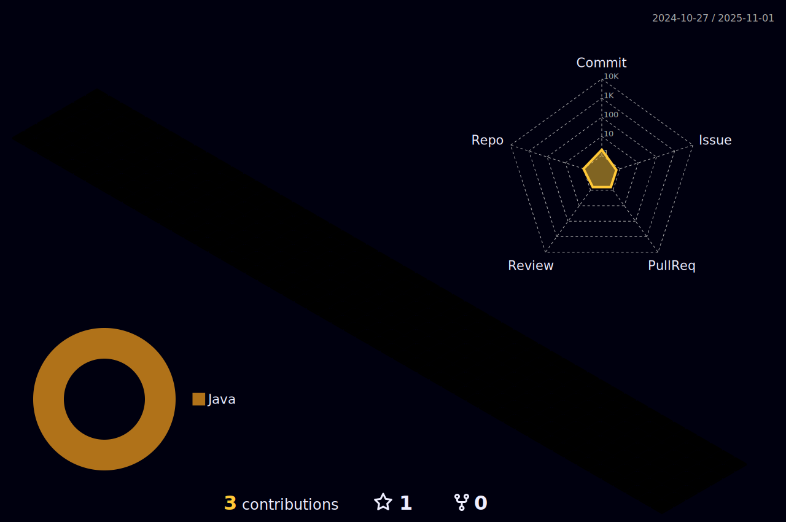

# :dizzy: Welcome!
I'm Huy, a boy with a passion for programming and web development. I'm currently a freshman at **Hanoi University of Science and Technology**.

# :books: Side Projects

### :sparkles: [**Chess**](https://github.com/huy-ngndinh/Chess) 
An origami-themed website where you can challenge a bot to a game of chess.

### :sparkles: [**VocaGraph**](https://github.com/huy-ngndinh/VocaGraph)
A website to learn vocabulary using semantic map

# :whale: My GitHub 

